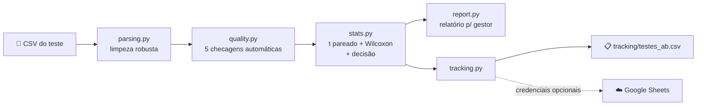

# 📊 Análise de Testes A/B de Cashback — Méliuz

> **Um analista de testes A/B que cabe num comando** — recebe o CSV de qualquer teste de cashback, audita a qualidade dos dados, roda a estatística, escreve o relatório para gestor e registra tudo numa planilha de acompanhamento. Sem tocar em código.


---

## 🎯 A pergunta que a ferramenta responde

> *"Dado esse teste A/B, qual variante de cashback devemos escalar para 100% do tráfego?"*

Hoje, cada análise de teste A/B leva de 2 a 4 horas e o resultado depende de quem está olhando. Esta solução transforma isso em **um comando (ou um pedido em português para uma IA)** — com a vantagem de que ela **nunca esquece de desconfiar dos dados**.

```bash
python scripts/analyze_ab_test.py --input data/dataset_01_parceiroA.csv
```

**Saída:** relatório Markdown apresentável a gestor + linha na planilha de acompanhamento (CSV local **e** Google Sheets). Para analisar um teste novo, basta trocar o `--input` — funciona com qualquer número de variantes, qualquer parceiro, qualquer período.

📈 **Planilha pública de acompanhamento:** [Google Sheets — Testes A/B rodados](https://docs.google.com/spreadsheets/d/1hOeHYmpwezzxMdAayZMLVnxn50PdaJfb-h5qr_OUlZU)

---

## 🏆 TL;DR — decisão dos 3 testes fornecidos

| Teste | 🏁 Decisão | Racional em uma linha |
|---|---|---|
| **Parceiro A** | Manter **Grupo 1** (3% cashback) | Mais cashback trouxe +GMV e +compradores, mas a margem líquida caiu pela metade — as 2 variantes perdem com p<0,0001 (t pareado **e** Wilcoxon). |
| **Parceiro B** | Manter **Grupo 1** (4% cashback) | Variantes perdem com significância na margem absoluta **e** nas métricas normalizadas (R$ 35,87/comprador vs R$ 26,26 e R$ 10,46) — decisão robusta mesmo com a suspeita de desequilíbrio de tráfego (ver abaixo). |
| **Parceiro C** | Manter **Grupo 1** (5% cashback) | Grupo 2 tem margem R$ 0 em 100% dos dias (comissão = cashback) — bug de instrumentação provável; e mesmo se o dado for real, R$ 0/dia perde de R$ 772,64/dia de qualquer jeito. |

Relatórios completos, com números, ressalvas e próximos passos: [`reports/`](reports/)

---

## 🕵️ O diferencial: os dados mentem, a ferramenta percebe

Os 3 datasets fornecidos continham **armadilhas reais** — e todas foram detectadas **automaticamente**, por checagens genéricas (nada foi hardcoded para um parceiro específico):

### 🪤 Armadilha 1 — O teste que deixou de ser um teste *(Parceiro A)*
Rastreando o % de cashback dia a dia, a ferramenta descobriu que os 3 grupos **só tiveram patamares distintos e estáveis até 22/fev**. Depois disso os grupos convergem para 5% — e há um pico sincronizado de 4 dias a **10% em todos os grupos ao mesmo tempo** (promoção geral, não variante). Analisar o período inteiro misturaria teste controlado com pós-teste. **A janela de decisão é restrita automaticamente ao período válido.**

### 🪤 Armadilha 2 — O grupo que trabalha de graça *(Parceiro C)*
O Grupo 2 tem `comissão == cashback` em **45 de 45 dias** — margem líquida de exatamente R$ 0 sempre. Padrão típico de coluna espelhada (bug de instrumentação). A ferramenta exclui o grupo da decisão estatística, **mas ainda compara descritivamente**: mesmo na hipótese do dado estar correto, a recomendação não muda. Decisão robusta às duas interpretações.

### 🪤 Armadilha 3 — A comparação de tamanhos diferentes *(Parceiro B)*
Grupos 2 e 3 têm consistentemente **~68% e ~64% do volume de compradores** do Grupo 1, dia após dia. Pode ser efeito real do cashback — ou alocação desigual de tráfego. Como margem absoluta favorece quem tem mais volume *independente da causa*, o relatório mostra **métricas normalizadas (margem/comprador e margem/% da GMV)** como checagem de sensibilidade. O Grupo 1 vence nas duas — a decisão não depende de qual explicação é a verdadeira.

> 💡 A filosofia: **decidir sempre que os dados permitirem, e ser explícito quando não permitirem** — dizendo exatamente o que falta para decidir (a ferramenta chega a estimar quantos dias a mais de coleta seriam necessários).

---

## 🗣️ Camada AI-native: pedir em português

Ninguém precisa decorar CLI. Abra este repositório em **Claude Code, Cursor, GPT ou Gemini** e peça:

> *"Analisa o teste A/B em `data/dataset_02_parceiroB.csv` e me diz qual variante escalar."*

- 🤖 [`AGENTS.md`](AGENTS.md) — instruções que qualquer agente de IA segue: rodar a CLI (nunca reimplementar a estatística), ler o relatório gerado e responder em linguagem de negócio, **sem esconder as ressalvas**.
- ⚡ `/analisar-ab-test <arquivo.csv>` — comando pronto para Claude Code ([`.claude/commands/analisar-ab-test.md`](.claude/commands/analisar-ab-test.md)).

A camada de IA é uma *interface* — o motor estatístico é determinístico e auditável. A IA traduz; quem decide é o método.

---

## 🚀 Como rodar (60 segundos)

```bash
# 1. Ambiente
python -m venv .venv
source .venv/Scripts/activate      # Windows (Git Bash) — Linux/Mac: source .venv/bin/activate
pip install -r requirements.txt

# 2. Análise (qualquer dataset, mesmo comando)
python scripts/analyze_ab_test.py --input data/dataset_01_parceiroA.csv
python scripts/analyze_ab_test.py --input data/dataset_02_parceiroB.csv
python scripts/analyze_ab_test.py --input data/dataset_03_parceiroC.csv
```

Cada execução gera:

| Artefato | Onde | O que é |
|---|---|---|
| 📄 Relatório | `reports/<dataset>.md` | Decisão, qualidade dos dados, estatística, limitações e próximos passos — legível por gestor |
| 📋 Linha de tracking | `tracking/testes_ab.csv` | Histórico de todos os testes: decisão, uplift, p-valores, ressalvas |
| ☁️ Linha no Sheets | [planilha pública](https://docs.google.com/spreadsheets/d/1hOeHYmpwezzxMdAayZMLVnxn50PdaJfb-h5qr_OUlZU) | Mesma linha, escrita via API quando as credenciais estão configuradas |

<details>
<summary>☁️ <b>Ativar a escrita no Google Sheets (opcional)</b></summary>

O pipeline funciona 100% sem credenciais (grava só o CSV). Para escrever também no Sheets:

1. Crie um projeto no Google Cloud e ative a **Google Sheets API**;
2. Crie uma **service account** e baixe a chave JSON;
3. Compartilhe a planilha com o `client_email` da service account (como Editor);
4. Exporte as variáveis:

```bash
export GOOGLE_SHEETS_ID="<id da planilha, o trecho da URL entre /d/ e /edit>"
export GOOGLE_SHEETS_CREDENTIALS_JSON="$(cat credentials.json)"
```

A integração é *best-effort*: se falhar (rede, permissão), o pipeline reporta e continua — o CSV local nunca é comprometido.
</details>

---

## 🏗️ Arquitetura



```
data/                       # datasets brutos (não alterar)
scripts/ab_toolkit/         # motor de análise reutilizável
  parsing.py                #   moeda pt-BR, linhas ruins, dedup por chave
  quality.py                #   checagens de confiabilidade do teste
  stats.py                  #   comparação pareada + veredito + decisão
  report.py                 #   Markdown apresentável a gestor
  tracking.py               #   CSV sempre; Google Sheets quando configurado
scripts/analyze_ab_test.py  # CLI única — o único entry point
reports/                    # um relatório .md por teste
tracking/testes_ab.csv      # histórico de todos os testes rodados
AGENTS.md                   # manual de operação para agentes de IA
```

**Por que essa separação?** Cada módulo tem uma responsabilidade e pode evoluir sozinho: amanhã dá para trocar o relatório Markdown por HTML, plugar outro teste estatístico ou adicionar uma checagem nova — sem tocar no resto. E a CLI única garante o requisito central: **zero alteração de código entre datasets**.

---

## 🧠 Metodologia estatística

| Escolha | O quê | Por quê |
|---|---|---|
| **Métrica de decisão** | Margem líquida diária (`comissão − cashback`) | Cashback maior costuma inflar GMV e compradores — mas quem paga a conta é a margem. A decisão olha **lucro**, não vaidade de volume. |
| **Pareamento por data** | Cada dia da variante comparado ao mesmo dia da baseline | Neutraliza sazonalidade, dia de semana e eventos externos que afetam todos os grupos ao mesmo tempo. |
| **Dupla validação** | Teste t pareado **+** Wilcoxon (α = 0,05) | O t assume normalidade das diferenças; o Wilcoxon não. Vencedor **só se os dois concordarem** — proteção barata contra outliers e caudas pesadas. |
| **Baseline** | "Grupo 1" por convenção; senão, o grupo de menor % de cashback médio | Regra explícita e determinística — o mesmo dataset sempre produz a mesma decisão. |
| **Sensibilidade** | Margem/comprador e margem/% da GMV sempre no relatório | Se os grupos têm tamanhos diferentes, a margem absoluta engana. As normalizadas confirmam (ou desmentem) a decisão. |
| **Honestidade** | Seção de limitações em todo relatório | Autocorrelação temporal, agregação por dia (não por usuário), múltiplas comparações sem correção — ditas com todas as letras, não escondidas. |

### 🛡️ As 5 checagens de qualidade (todas genéricas)

| # | Checagem | O que pega | Disparou em |
|---|---|---|---|
| 1 | **Parsing defensivo** | Moeda pt-BR, linhas em branco, duplicatas exatas **e** duplicatas de chave `(data, grupo, parceiro)` com valores conflitantes, negativos | — |
| 2 | **Bug de instrumentação** | `cashback ≈ comissão` em ≥90% dos dias (coluna espelhada) | 🎯 Parceiro C |
| 3 | **Mudança de patamar** | % de cashback muda de forma sustentada no meio do teste → janela de decisão restrita automaticamente | 🎯 Parceiro A |
| 4 | **Picos simultâneos** | Dias de GMV no top-10% em todos os grupos ao mesmo tempo → evento externo, não variante | ℹ️ A, B e C |
| 5 | **Desequilíbrio de população** | Volume de compradores da variante consistentemente fora de ±20% da baseline → possível alocação desigual | 🎯 Parceiro B |

---

## 📦 Entregáveis (checklist do desafio)

- ✅ **Solução reutilizável** — CLI única + motor modular, zero mudança de código entre datasets
- ✅ **Relatórios dos 3 testes** — [`reports/`](reports/), apresentáveis a gestor
- ✅ **Planilha de acompanhamento** — [Google Sheets público](https://docs.google.com/spreadsheets/d/1hOeHYmpwezzxMdAayZMLVnxn50PdaJfb-h5qr_OUlZU) com escrita via API (+ espelho local em [`tracking/testes_ab.csv`](tracking/testes_ab.csv))
- ✅ **Camada de linguagem natural** — [`AGENTS.md`](AGENTS.md) + comando `/analisar-ab-test` para Claude Code
- ✅ **README de como rodar** — você está nele 🙂

## 🧰 Stack

**Python 3.10+** · pandas · numpy · scipy · gspread + google-auth *(opcionais, só para o Sheets)* — ver [`requirements.txt`](requirements.txt)

---

<p align="center"><i>Feito com olho crítico nos dados — porque a análise mais perigosa é a que confia cegamente no CSV.</i> 🔍</p>
